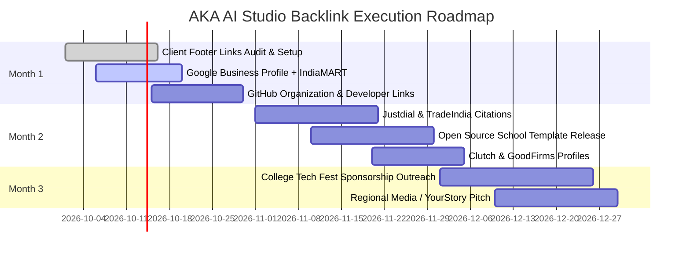

# AKA AI Studio — Comprehensive Backlink & Off-Page SEO Strategy Guide

> **Target Objective**: Build high-authority, relevant, and natural backlinks to establish domain authority (`akaaistudio.in`), dominate local Google search for website development in Bihar & Eastern UP, and drive inbound client leads from shops, schools, colleges, and hotels.

---

## 1. Executive Summary

As a student-led web studio founded by Adarsh Pandey, Ayush Kumar Sharma, and Kumari Abhilasha, AKA AI Studio has unique advantages:
- **Story Angle**: 3 MCA students helping regional Indian businesses digitize with fast 4G websites and WhatsApp integration.
- **Client Footprint**: Real live client websites (schools, hotels, banquet halls, retailers) that can host natural attribution backlinks.
- **Geographic Focus**: Tier-2 and Tier-3 hubs across Bihar (Gopalganj, Siwan, Patna) and Eastern UP (Varanasi, Gorakhpur).

---

## 2. Pillar 1: Client Website Footer Attribution (The #1 Engine)

Every client website built by AKA AI Studio represents a live, perpetual backlink.

### Best Practice Implementation
Instead of a generic link, use branded semantic anchor text:
```html
<!-- Recommended HTML in all client footers -->
<p class="footer-attribution">
  Website designed &amp; developed by 
  <a 
    href="https://www.akaaistudio.in/?ref=client-footer" 
    target="_blank" 
    rel="noopener"
    title="AKA AI Studio — Websites &amp; Software for Local Businesses"
  >
    AKA AI Studio
  </a>
</p>
```

### Existing Client Targets to Verify / Add Backlink:
1. **Nav Bharat Public School**: `https://navbharatpublicschool.info`
2. **Mohit Enterprise Group**: `https://mohitmobile.in`
3. **Hotel Sarkar & Marriage Hall**: `https://hotel-sarkar.vercel.app`
4. **Sandeep Traders**: `https://mandeepkumarkushwaha-cmyk.github.io/sandeep-traders/`
5. **National Model School**: `https://national-model-school.vercel.app/`
6. **Navratri Vibes**: `https://www.elitesgroup.org/`

---

## 3. Pillar 2: High-Authority Local Citations & Directories

Local NAP (Name, Address, Phone) consistency across Indian business directories signals extreme trust to Google's Local Map Pack algorithm.

| Platform | Domain Authority (DA) | Status | Listing Category |
| :--- | :--- | :--- | :--- |
| **Google Business Profile (GBP)** | 100 | Priority 1 | Software Company / Web Designer |
| **IndiaMART** | 88 | Priority 1 | Website Design & Development Services |
| **Justdial** | 84 | Priority 1 | Website Designers in Gopalganj & Varanasi |
| **Sulekha** | 78 | Priority 2 | Web Design Services |
| **TradeIndia** | 76 | Priority 2 | IT & Web Development Services |
| **Crunchbase** | 90 | Priority 2 | Technology Startup |
| **Clutch.co / GoodFirms** | 86 / 82 | Priority 2 | Web Development Agency India |

### Required NAP Format:
* **Business Name**: AKA AI Studio
* **Website**: `https://www.akaaistudio.in`
* **Phone**: `+91 82353 08885` / `+91 93697 91938`
* **Email**: `akaaistudio03@gmail.com`
* **Address**: Gopalganj, Bihar 841428 / Varanasi, UP

---

## 4. Pillar 3: Academic, University & Alumni Portfolios

Search engines place the highest trust on `.ac.in` and `.edu` domains.

### Tactical Steps:
1. **Student MCA Portfolios**:
   - Adarsh Pandey's GitHub & personal portfolio linking to `https://www.akaaistudio.in`.
   - Ayush Kumar Sharma's GitHub & portfolio linking to `https://www.akaaistudio.in`.
   - Kumari Abhilasha's GitHub & portfolio linking to `https://www.akaaistudio.in`.
2. **College Project Showcase**:
   - Submit AKA AI Studio projects as verified MCA capstone projects to university departmental pages, placement portals, and student innovation cells.
3. **College Tech Fest Sponsorship / Partnership**:
   - Partner with local engineering & MCA college technical fests (e.g. hackathons in Varanasi, Gorakhpur, Patna) as the official "Web & Digital Partner", securing a homepage sponsor logo backlink on `.ac.in` fest domains.

---

## 5. Pillar 4: Open Source & GitHub Backlinks

Developer community backlinks build authoritative tech signals.

### Tactical Steps:
1. **Open-Source Website Starter Templates**:
   - Publish a free, open-source repository on GitHub: `nextjs-school-website-template` or `nextjs-local-shop-template`.
   - In the `README.md` and live demo footer, include:
     ```markdown
     Built with care by [AKA AI Studio](https://www.akaaistudio.in) — MCA student founders building websites for local India.
     ```
2. **Curated Awesome Lists**:
   - Submit to curated GitHub lists like `awesome-nextjs`, `awesome-tailwindcss`, and Indian developer registries.
3. **Developer Platforms**:
   - **Dev.to / Hashnode / Medium**: Publish technical write-ups detailing how AKA AI Studio built sub-second websites on 4G networks in rural Bihar. Link back to case studies.

---

## 6. Pillar 5: Digital PR & Regional Media Outreach

Regional news outlets love stories of youth entrepreneurship.

### Story Pitch Angle:
> *"How three MCA students from Bihar and UP built AKA AI Studio to bring local schools, banquet halls, and retail stores online with sub-second 4G websites and WhatsApp automation."*

### Target Publications:
- **State Media**: Prabhat Khabar Tech/Youth column, Dainik Jagran local Varanasi/Gopalganj editions, Hindustan.
- **Tech & Startup Media**: YourStory (SMB Stories / Student Entrepreneurs), Inc42, Startup Pedia, Tech in Asia India.

---

## 7. 30-60-90 Day Execution Roadmap



### Month 1 (Immediate - High Impact):
- [x] Verify client footer attribution on all 6 live client domains.
- [ ] Claim and verify Google Business Profile for AKA AI Studio.
- [ ] Create IndiaMART & Justdial verified business profiles.
- [ ] Add studio links to all founders' GitHub profiles and LinkedIn about sections.

### Month 2 (Authority Building):
- [ ] Publish 1 free GitHub starter template with live demo link.
- [ ] Publish 2 in-depth articles on Dev.to / Medium about local web development.
- [ ] Register on Clutch.co and gather 5 client reviews.

### Month 3 (Scale & PR):
- [ ] Reach out to 2 regional student hackathons as website partner.
- [ ] Send press releases to regional Hindi/English youth journalists.
